# [MC number] [Manufacturing growth and the lives of Bangladeshi women] Validation and Replication results


SUMMARY
-------


ASMKLDNFJKANF

Data description
----------------

### Data Sources
> All data used in the paper were collected by the authors.  [All data are available for public use here.](https://www.sciencedirect.com/science/article/abs/pii/S0304387815000085?via%3Dihub#ec-research-data) 

#### Example data 

- All data is provided, and the link to .zip files is is available with the manuscript.
- The data files include the codebook which is also available for free. 


### Analysis Data Files


- [ ] No analysis data file mentioned
- [ ] Analysis data files mentioned, not provided (explain reasons below)
- [x] Analysis data files mentioned, provided. File names listed below.


```{r dataAn, warning=FALSE, message=FALSE}
files <- list.files(pattern = "\\.dta$")
files
```


```
[1] "JDE HM data -- educational attainment.dta"           
[2]"JDE HM data -- enrollment trends.dta"               
[3] "JDE HM data -- enrollment.dta"                       
[4]"JDE HM data -- garment employment growth.dta"       
[5] "JDE HM data -- individual level.dta"                 
[6]"JDE HM data -- labor supply.dta"                    
[7] "JDE HM data -- marriage and childbearing trends.dta" 
[8]"JDE HM data -- marriage and childbearing.dta"       
[9] "JDE HM data -- village level.dta" 
```


Data checks
-----------

- The data can be read using STATA.
- The data is in custom format (DTA) 
- The data do not have variable labels.
- After running the PII ([PII_stata_scan.do](PII_stata_scan.do), sourced from [here](https://github.com/J-PAL/stata_PII_scan), there are 10 variables.


Code description


There is one provided Stata do file named "empirical analysis.do". All data tables and figures are coded in this file. Each table/figure is preceeded by clear headers describing which table/figure the following code represents.

Refer to "code-checkAk.xls" to see a list of tables and figures and status of replication.


Stated Requirements
---------------------


- [X] Software Requirements specified as follows:
  - Sata

Actual Requirements, if different
---------------------------------

- [X] Software Requirements 
  - [X] Stata
    - Download package outreg2
- [X] Time Requirements 
  - Five minutes

> [REQUIRED] Please amend README to contain complete requirements. 

Computing Environment of the Replicator
---------------------

- Mac Laptop, MacOS 10.13.6, 8 GB of memory
- Stata/MP 14.2


Replication steps
-----------------

1. Downloaded data and code from [URL provided](https://www.sciencedirect.com/science/article/abs/pii/S0304387815000085?via%3Dihub#ec-research-data) in the manuscript.
2. Added the config.do to track log files for the replication.
3. Added code to install the estout package required to create the tables in csv
4. Ran code as per README, but the code for table 8 did not run. Neither did firgure 7. They both have a variable that is missing in the dataset.
5. I am unable to make changes to make the code work. The authors will have to add the varibale _postgarmentvillage_ to the dataset.
6. Commented out table 7 and figure 8 code and ran the rest of the code.
7. Figure 6 also did not run because the variables yearsexposedage and yearsexposedage2 were not created.
8. I  created two variables to make the code work. The variable yearsexposedage is an interaction of yearsexposed and age and variable yearsexposedage2 is an interaction of yearsexposed and age2. However, the code still does not recognize these variables and I am unable to produce Figure 6.


Findings
--------

### Data Preparation Code

Examples:

- Program `empirical analysis.do` failed to produce any output for table 8 and figure 7. The rest of the file ran without errors.

### Tables

Examples:

- Table 1: Looks the same
- Table 2: Looks the same
- Table 3: Looks the same
- Table 4: Looks the same
- Table 5: Looks the same
- Table 6: Looks the same
- Table 7: Looks the same
- Table 8: no output
- Table 9: Looks the same
- Table 10: Looks the same


### Figures

Example:

- Figure 1: Looks the same
- Figure 2: Looks the same
- Figure 3: Looks the same
- Figure 4: Looks the same
- Figure 5: Looks the same
- Figure 6: no output
- Figure 7: no output


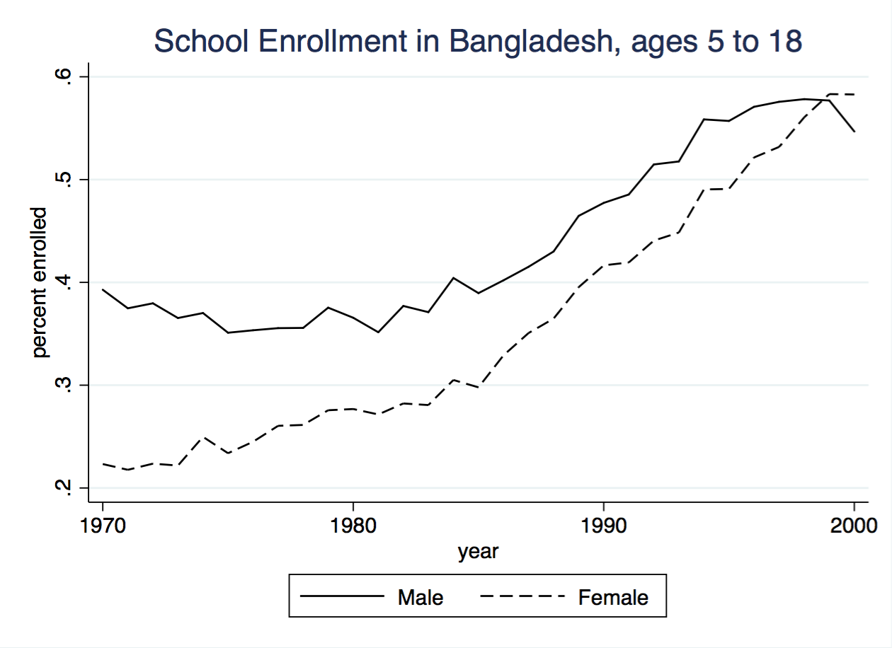
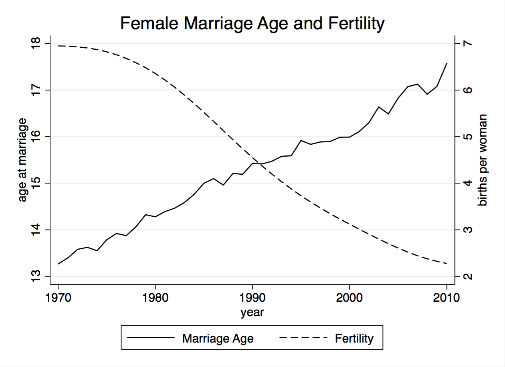
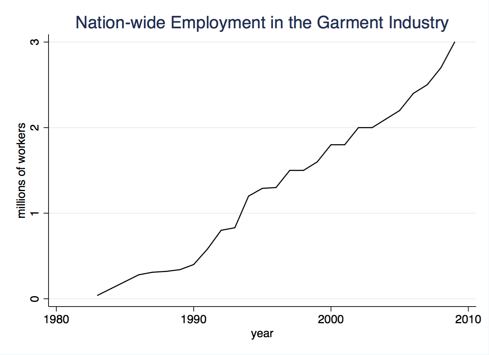

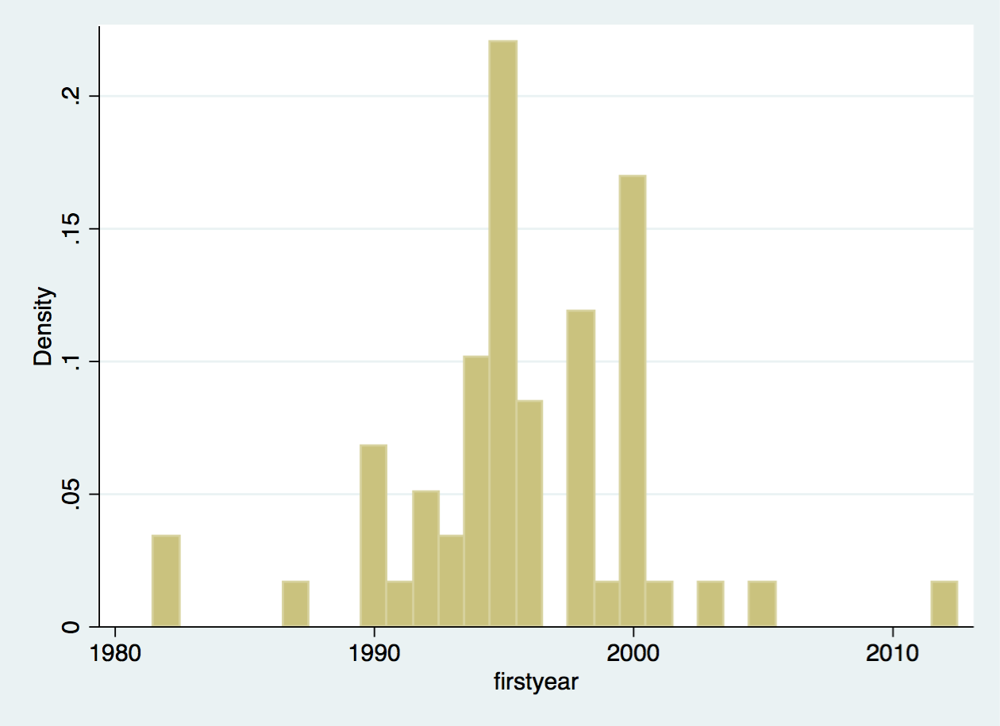
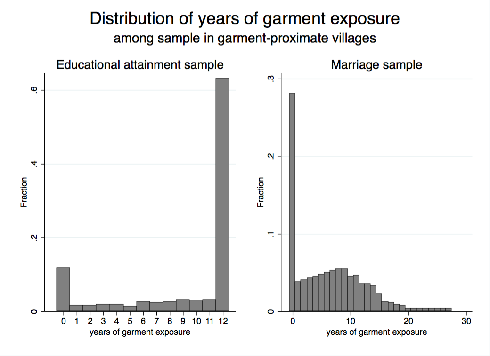
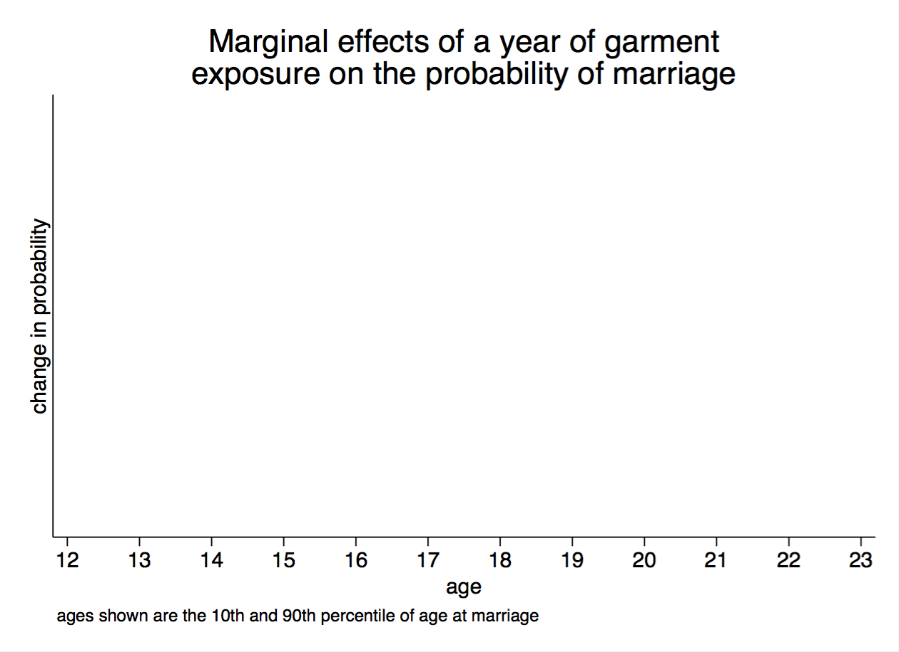
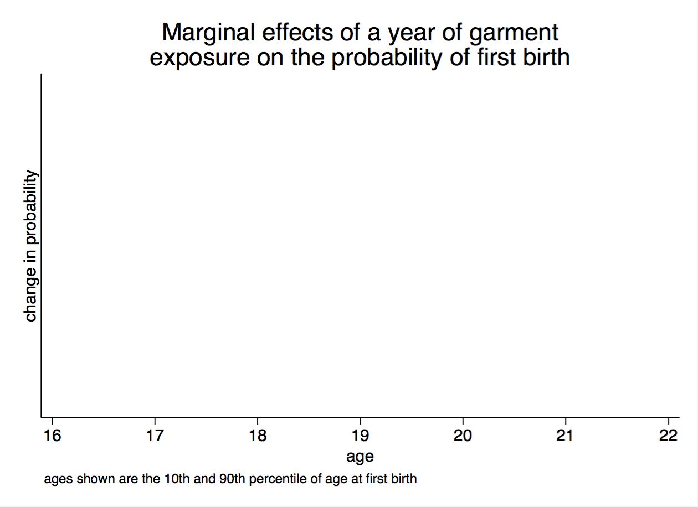

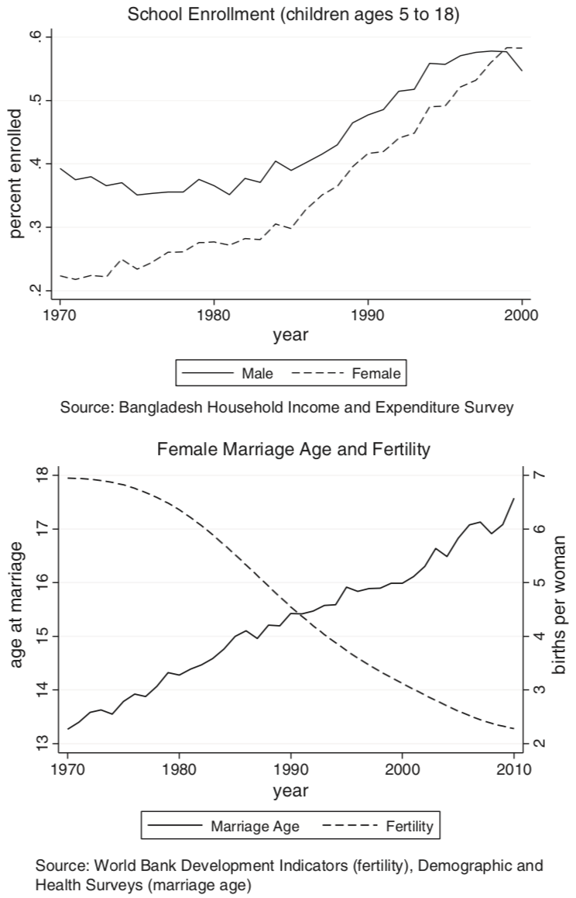
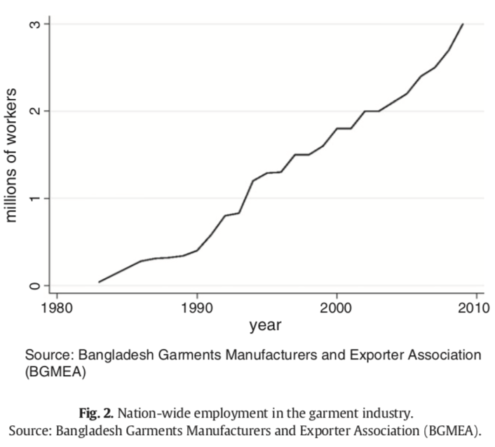
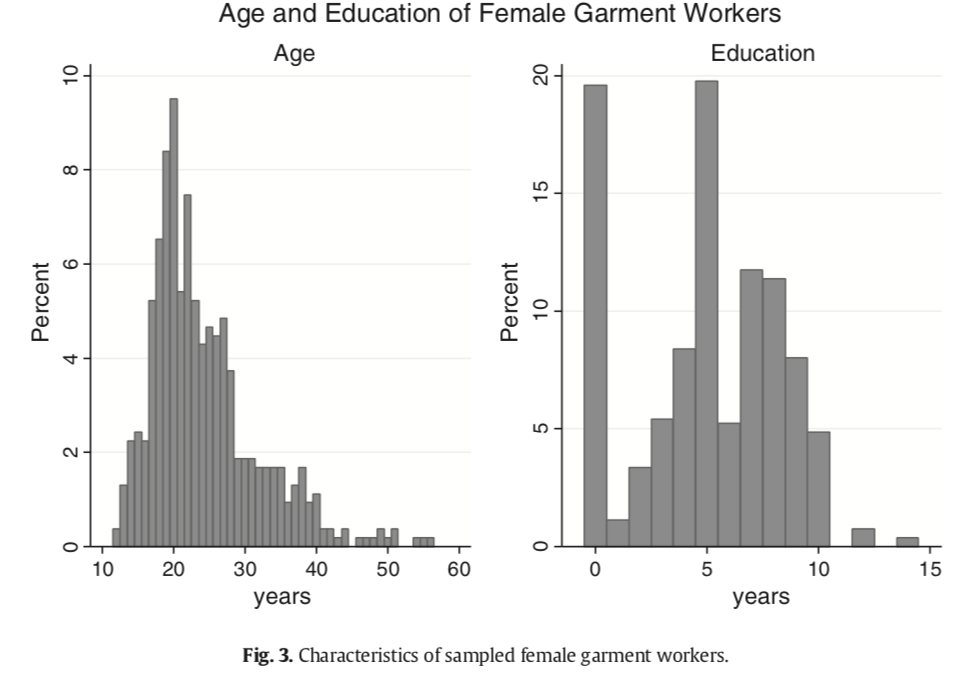
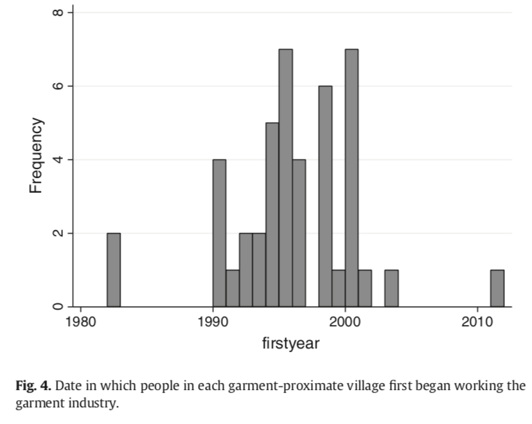
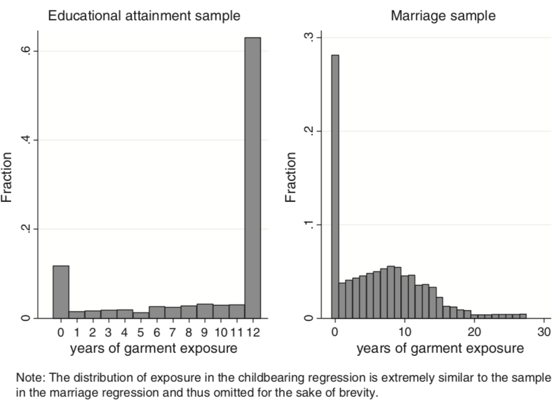
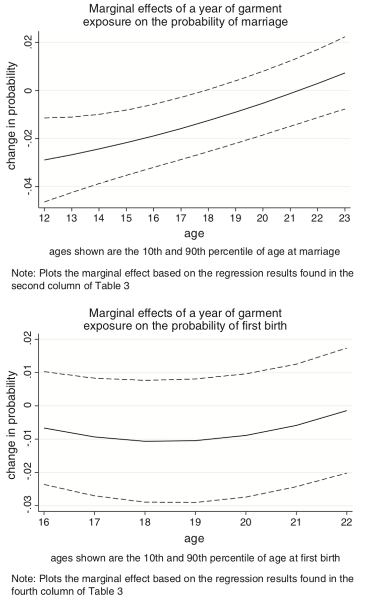
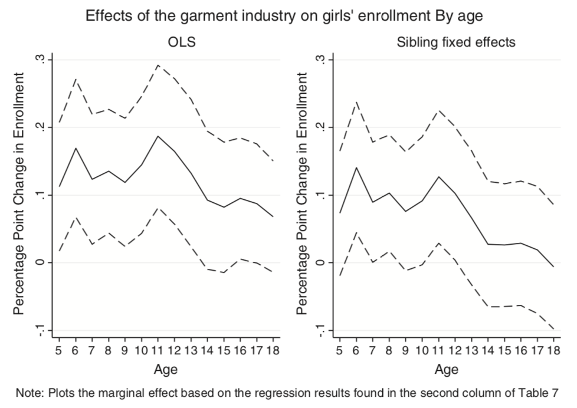

  
### In-Text Numbers

[X] There are no in-text numbers, or all in-text numbers stem from tables and figures.

[ ] There are in-text numbers, but they are not identified in the code


Classification
--------------


- [ ] full reproduction
- [X] full reproduction with minor issues
- [ ] partial reproduction (see above)
- [ ] not able to reproduce most or all of the results (reasons see above)

### Reason for incomplete reproducibility

- [ ] `Discrepancy in output` (either figures or numbers in tables or text differ)
- [ ] `Bugs in code`  that  were fixable by the replicator (but should be fixed in the final deposit)
- [ ] `Code missing`, in particular if it  prevented the replicator from completing the reproducibility check
- [X] `Code not functional` is more severe than a simple bug: it  prevented the replicator from completing the reproducibility check
- [ ] `Software not available to replicator`  may happen for a variety of reasons, but in particular (a) when the software is commercial, and the replicator does not have access to a licensed copy, or (b) the software is open-source, but a specific version required to conduct the reproducibility check is not available.
- [ ] `Insufficient time available to replicator` is applicable when (a) running the code would take weeks or more (b) running the code might take less time if sufficient compute resources were to be brought to bear, but no such resources can be accessed in a timely fashion (c) the replication package is very complex, and following all (manual and scripted) steps would take too long.
- [X] `Data missing` is marked when data *should* be available, but was erroneously not provided, or is not accessible via the procedures described in the replication package
- [ ] `Data not available` is marked when data requires additional access steps, for instance purchase or application procedure. 
